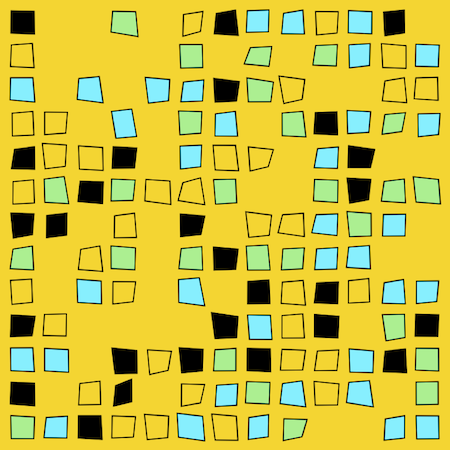
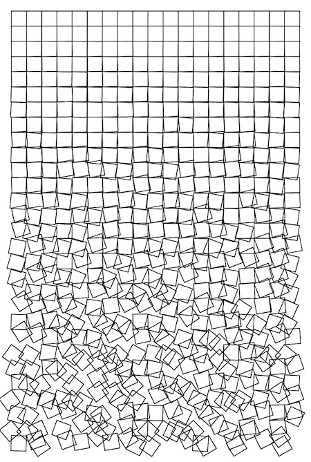
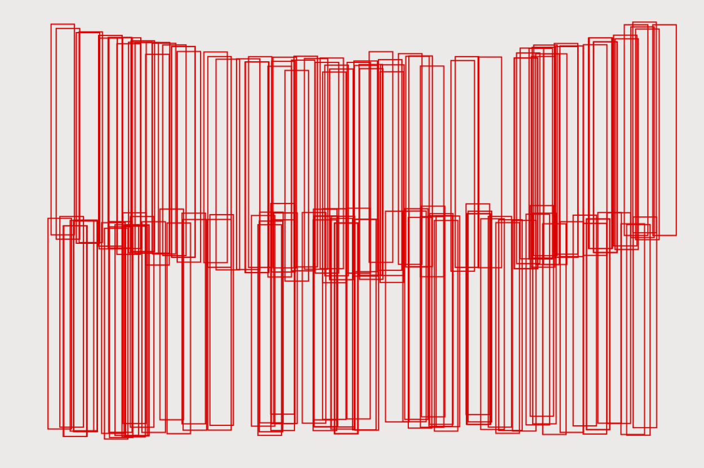
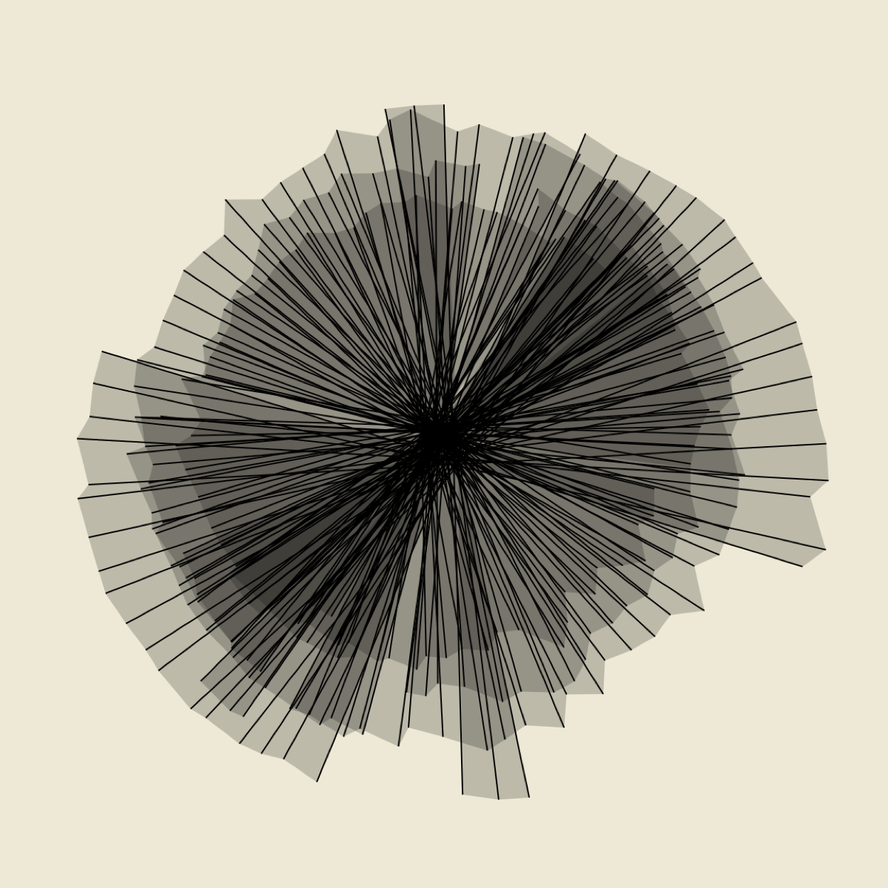
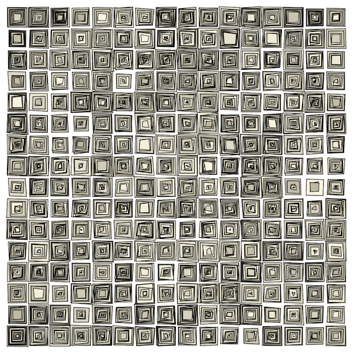

# art-dust

Use Xcode playgrounds to play with generative art projects. API is UIKit (easier to find answers for on stackoverflow) and CoreGraphics.

To save the images as PDF the directory 
*~/Documents/Shared Playground Data* needs to exist (Xcode won't set it up).

## ad001

Converted generative art by [kovach.me](https://www.kovach.me/posts/2018-03-07-generating-art.html) from Haskell and the Cairo rendering engine to XCode playgrounds and CoreGraphics.

## ad002

[Schotter](http://www.medienkunstnetz.de/works/schotter/) by [Georg Nees](https://en.wikipedia.org/wiki/Georg_Nees)

## ad003

[Untitled - Vera Molnár, 1985](https://collections.vam.ac.uk/item/O499339/print-molnar-vera/) by [Vera Molnár](https://en.wikipedia.org/wiki/Vera_Moln%C3%A1r)

## ad004

## ad005

[(Dés)Ordres 1974](http://dam.org/artists/phase-one/vera-molnar/artworks-bodies-of-work/-des-ordres) by [Vera Molnár](https://en.wikipedia.org/wiki/Vera_Moln%C3%A1r)

